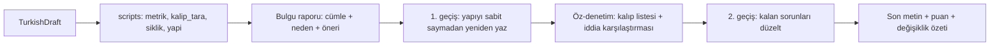

# Turkish Writing Skills Repository — Plan

## Goal

A repo at `/Users/ozgur/turkce-yazi-yazma` (currently empty, not a git repo) containing five Turkish-language skills that together implement the five-part system (ses arşivi, karşıt örnekler, tür profili, Türkçe editör, geri bildirim hafızası). Text-only, no voice memos, no fine-tuning. Everything bundled is redistributable under a permissive or CC license.

## Design decisions (confirmed)

- Skill bodies, checklists and pattern catalogs written in Turkish; frontmatter `description` in Turkish with a few English trigger words (`Turkish`, `humanize`) for discovery.
- Markdown skills plus small Python scripts. All scripts stdlib-only (Claude.ai sandbox has no network / no pip); `zeyrek` morphology is an optional `--zeyrek` flag that only activates when importable locally.
- Public repo ships generic skills and `voice.example/` templates; real texts live in gitignored `voice/` (or a private overlay repo).
- Repo follows the `skills/<name>/SKILL.md` layout so `npx skills add ozgur/turkce-yazi-yazma` works and each skill folder can be zipped individually for Claude.ai. Each folder is self-contained (its own `scripts/` and `data/`).

## Repository layout

```
turkce-yazi-yazma/
├── README.md                 # TR (+ short EN): why, install for Cursor/Claude Code/Codex/Claude.ai
├── AGENTS.md                 # how agents navigate the repo, skill catalog, conventions
├── LICENSE                   # MIT for code + prose; data licenses listed separately
├── .gitignore                # voice/, corpus/, tools/cache/
├── skills/
│   ├── turkce-editor/        # core: review + rewrite existing Turkish text
│   ├── turkce-taslak/        # draft from notes or from an English source without copying it
│   ├── tur-profilleri/       # reel / deneme / makale / blog rules
│   ├── kisisel-ses/          # voice archive + author features + example selection
│   └── geri-bildirim-hafizasi/ # turn each correction into a durable preference
├── voice.example/            # templates + dummy entries for the personal overlay
├── tools/                    # one-off data builders (not shipped inside skills)
├── tests/                    # pytest for scripts + golden "translationese" samples
└── docs/                     # yontem.md, kaynaklar.md (legal table), arastirma.md
```

## The five skills

### 1. `turkce-editor` (auto-invocable)

The "Türkçe editör". Workflow the agent follows:



- `SKILL.md`: modes `incele` (report only), `düzelt` (rewrite), `puanla` (LLM-as-judge rubric 0-100 over çeviri kokusu, AI kalıbı, ritim, somutluk, tür uyumu, ses uyumu). Hard rule: no new facts, numbers or claims may appear in the rewrite; agent must list every claim it removed or altered.
- `references/kaliplar.md`: Turkish AI-cliché catalog with before/after pairs. Seeds: "yalnızca X değil aynı zamanda Y", "bu bağlamda", "özünde", "dönüşüm yolculuğu", "günümüz dünyasında", "önemli bir rol oynamaktadır", "sonuç olarak", "göz önüne alındığında", "kapsamlı", nominalization chains, triple lists, artificial contrasts, intro restated in conclusion, claims without actors.
- `references/ceviri-kokusu.md`: translationese catalog grounded in Turkish translation-studies findings: `tarafından` passives where Turkish would use active/event-focused passive, indefinite `bir` calqued from English "a", `-e sahip` for "have", `bir şekilde` adverbial calque, `gerçekleştirmek/sağlamak` light verbs, overt subject pronouns where Turkish drops them, English SVO order and sentence-by-sentence mirroring, pre-nominal relative clause pile-ups, `-lık/-lik` abstract nouns instead of verbs.
- `references/ritim.md`: paragraph and sentence rhythm guidance per register; what burstiness looks like in Turkish.
- `scripts/` (stdlib only, JSON + Turkish summary output):
  - `metrik.py`: Turkish-aware sentence split (abbreviation list), syllable count via vowel counting, Ateşman and Bezirci-Yılmaz scores with bands, sentence-length mean/std/CV (burstiness), paragraph-length uniformity, predicate-ending diversity (`-dır`, `-maktadır`, `-mıştır` share), `tarafından` + passive-morpheme rate, `bir` density, overt pronoun density, abstract-noun-suffix rate, sentence-initial connective rate.
  - `kalip_tara.py`: regex scan against `data/ai_kaliplari.tsv` and `data/ceviri_kokusu.tsv` (pattern, category, severity, fix hint); outputs a 0-100 "AI/çeviri izi" score with five Turkish bands.
  - `siklik.py`: flags words absent from or rare in bundled frequency lists (hallucinated or over-formal forms) and words overused within the text; `--yazili` (Leipzig news) vs `--konusma` (OpenSubtitles) register switch; optional `--zeyrek` lemmatization and morphology-failure report.
  - `yapi.py`: triple-list rate, "X değil Y" rate, intro/outro Jaccard similarity, markdown/list density (reels must not contain bullets), em-dash and odd-unicode counts.
- `data/`: `ai_kaliplari.tsv`, `ceviri_kokusu.tsv`, `siklik_konusma.tsv` (trimmed hermitdave OpenSubtitles list, CC BY-SA 4.0), `siklik_yazili.tsv` (trimmed Leipzig `tur_news_2024` words, CC BY 4.0), `kisaltmalar.txt`, `LICENSES.md` with attributions.

### 2. `turkce-taslak` (auto-invocable)

Drafting skill with two entry paths: from your own Turkish notes, or from an English source. For sources it enforces the de-anchoring workflow: fill a `bilgi kartı` (Ne oldu / sayı-kanıt / kaynağın tam iddiası / senin görüşün / Türkiye'deki izleyici için anlamı / belirsiz olan) then write from the card only, source text removed from working context. `scripts/kaynak_hizala.py <kaynak> <taslak>` detects paragraph-order mirroring via shared numbers and named entities, and flags numbers/entities present in the draft but absent from the source (fabrication check). Pulls the genre profile and voice examples before writing.

### 3. `tur-profilleri` (explicit invocation)

`profiller/reel.md`, `deneme.md`, `makale.md`, `blog.md`: target length, sentence-length band, hitap (sen/siz/biz), opening and closing moves, rhythm, what is forbidden (e.g., reel: no headings, no lists, spoken register, one idea; makale: sourced claims, no chatbot summaries). Genre-specific Ateşman/burstiness targets calibrated in Phase 6.

### 4. `kisisel-ses` (explicit invocation)

Implements what the research supports instead of "write like me" with many examples: (a) select only relevant past texts, (b) state author features explicitly, (c) contrast with rejected versions.

- `references/arsiv-yapisi.md`: `voice/onaylanan/<tür>/*.md` with frontmatter (tür, tarih, konu, etiketler).
- `scripts/ses_ozellikleri.py`: derives `voice/profil.md` features from the archive (sentence-length distribution, favourite connectives and verbs, opening move types, pronoun rate, punctuation habits, paragraph length).
- `scripts/ornek_sec.py`: picks the k most relevant approved texts for the current task (same genre, TF-IDF cosine on content words, stdlib).
- `references/karsit-ornekler.md`: JSONL format `{reddedilen, yorum, son_hal, tür, kural_adayı}` and how to present pairs in the prompt.

### 5. `geri-bildirim-hafizasi` (explicit invocation)

After each editing session: capture inline comments ("bu cümle İngilizceden çevrilmiş gibi", "meslek adı verme, süreci adlandır", "not this but that kullanma"), append the rejected/comment/approved triple via `scripts/karsit_ekle.py`, distil a candidate rule into `voice/tercihler.md` (one rule, one example, one counter-example), merge duplicates, and promote rules seen 3+ times into the editor's checklist section that `turkce-editor` reads at start.

## Data sources and legal status (documented in `docs/kaynaklar.md`)

- Bundled: Leipzig Corpora Collection Turkish word lists (CC BY 4.0); OpenSubtitles frequency list from `hermitdave/FrequencyWords` (CC BY-SA 4.0, data folder keeps that license); our own generated LLM corpus (Phase 6).
- Downloadable by `tools/fetch_data.sh` but not committed: Leipzig sentence files (news/web/Wikipedia), Turkish Wikipedia dump samples (CC BY-SA), TurBLiMP minimal pairs (CC BY 4.0) for grammar spot tests.
- Referenced only, manual use: TNC v3 and TS Corpus (free, web query only, no bulk download), Turkish Discourse Bank and METU corpus (academic license by email), Bilkent Turkish Writings (academic use only). Skill text tells the agent to suggest a TNC query when a phrase's naturalness is in doubt, rather than pretending to check.
- Tools: `zeyrek` (MIT) optional; Zemberek itself (Apache-2.0, Java) documented as an alternative, not required.

## Empirical calibration (Phase 6, `tools/` + `docs/yontem.md`)

Instead of guessing which phrases are AI-tells in Turkish: generate ~300 Turkish texts across the four genres with three or four different LLMs on neutral topics (Turkish Wikipedia titles), compare 1-3-gram log-odds against Leipzig human text, manually review the top ratio n-grams into `ai_kaliplari.tsv`, and take human-register percentiles for Ateşman, burstiness and predicate diversity as the thresholds in `metrik.py`. Generated corpus stays gitignored; derived lists ship.

## Out of scope (deliberately)

Fine-tuning / DPO (the source docx recommends it; scope is LLM-prompting only), voice memos, any non-redistributable corpus, "beat the detector" goals.

## Research grounding (cited in `docs/arastirma.md`)

- "Catch Me If You Can? Not Yet" (Findings of EMNLP 2025): few-shot style imitation fails on blogs/forums; more examples give limited gains, so skills rely on selection + explicit features + contrast.
- Yazan, Verberne, Situmeang (ECIR 2025): author features + contrastive examples give 15% relative improvement over plain RAG; basis for `kisisel-ses`.
- PEARL (Mysore et al.): retrieve only task-useful past texts; basis for `ornek_sec.py`.
- TurBLiMP, Cetvel: why "Turkish" in a model name does not mean natural Turkish; used for spot tests, not as a dependency.

## Implementation phases

1. **Skeleton**: git init, README/AGENTS/LICENSE/.gitignore, `tools/fetch_data.sh` (Leipzig + hermitdave), trim lists, `data/LICENSES.md`, `docs/kaynaklar.md` legal table.
2. **Editor skill**: `skills/turkce-editor/SKILL.md` (Turkish), `references/{kaliplar,ceviri-kokusu,ritim,puanlama}.md` with before/after pairs; stdlib scripts `metrik.py`, `kalip_tara.py`, `siklik.py` (optional `--zeyrek`), `yapi.py`; seed `ai_kaliplari.tsv` / `ceviri_kokusu.tsv`; pytest golden samples.
3. **Drafting skill**: `skills/turkce-taslak/SKILL.md` with bilgi kartı workflow, `references/bilgi-karti.md`, `scripts/kaynak_hizala.py` + tests.
4. **Genre profiles**: `skills/tur-profilleri/SKILL.md` + `profiller/{reel,deneme,makale,blog}.md`.
5. **Voice + feedback**: `skills/kisisel-ses` (arşiv yapısı, `ses_ozellikleri.py`, `ornek_sec.py`), `skills/geri-bildirim-hafizasi` (`karsit_ekle.py`, tercih formatı), `voice.example/` templates.
6. **Calibration + release**: `tools/derive_patterns.py` + `docs/yontem.md`; generate LLM corpus, derive cliché list and metric thresholds, update data; finalize README install docs for Cursor/Claude Code/Codex/Claude.ai; run full test suite.
